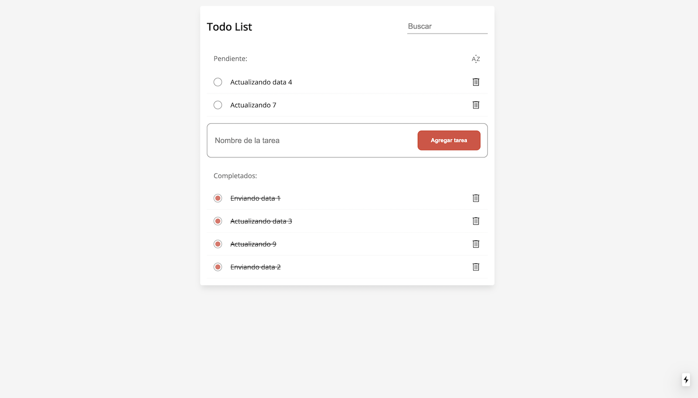

# InfoCasas Frontend Challenge Criteria


### Cómo levantar el Front End:
El desarrollo está como el proyecto lo solicitaba en NextJS.
```
npm run dev
```


### Como levantar la base de datos local:
se utilizo JSON-SERVER la versión para levantar una api localmente el comando es el siguiente: 

```
npm run db 
```

### Imagenes del Proyecto:




### Ruta deployment:


### Requerimientos

- [x]  Create, list, delete, update todos (using the API provided below)
- [x] Filter by string
- [x] Sort by